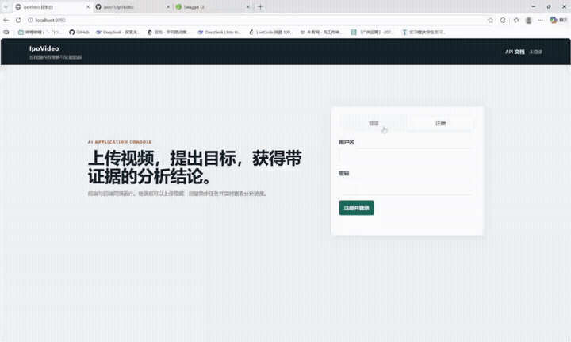
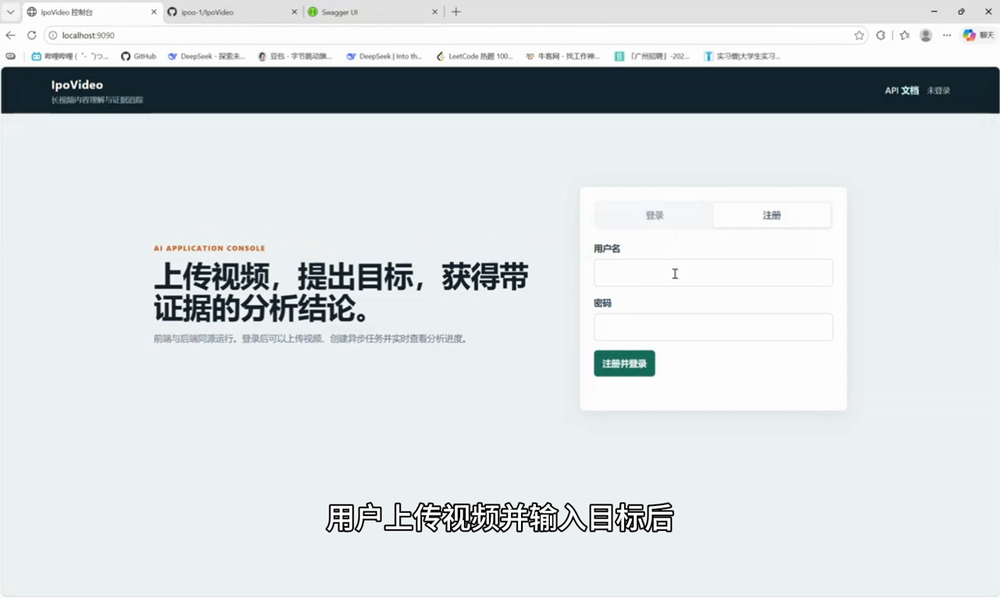
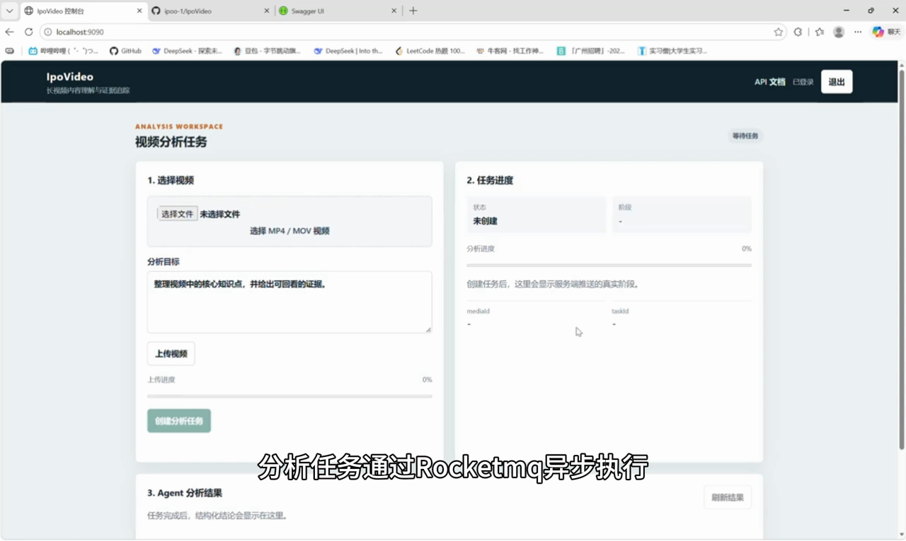
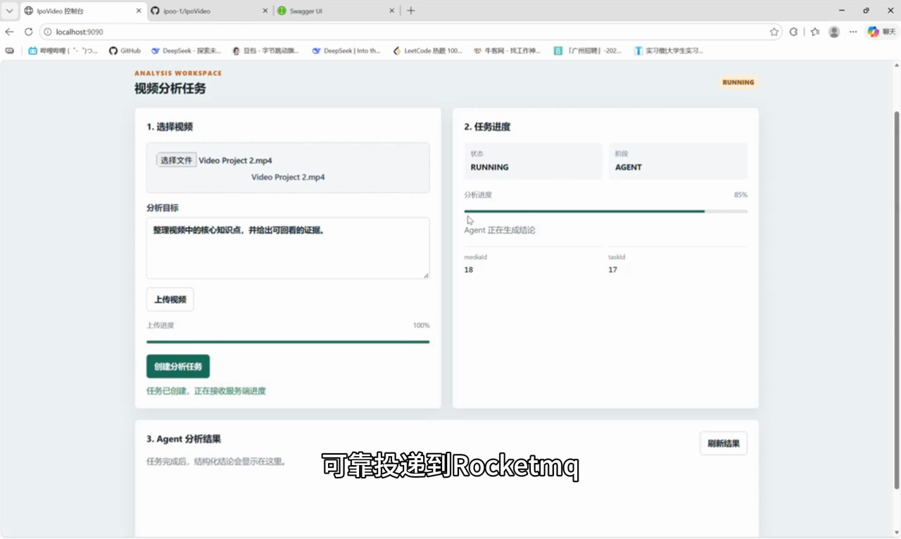
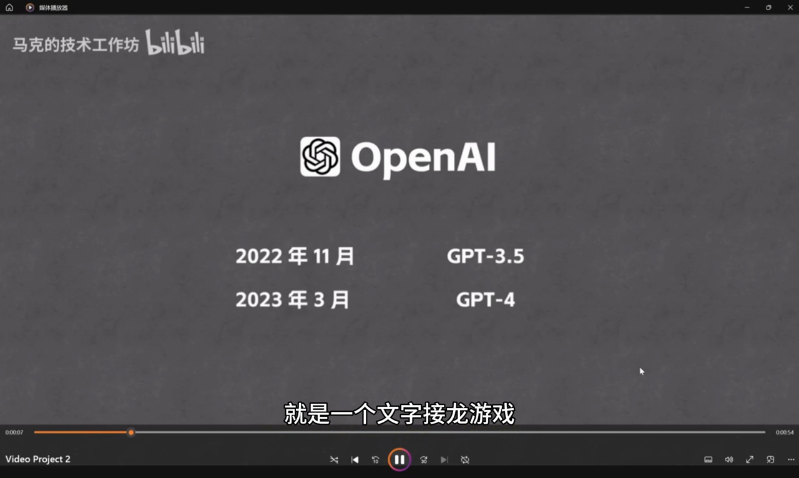
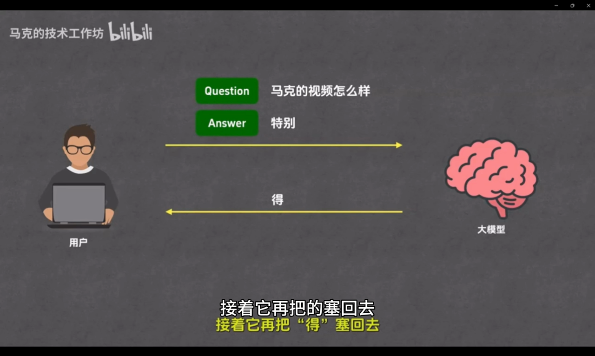
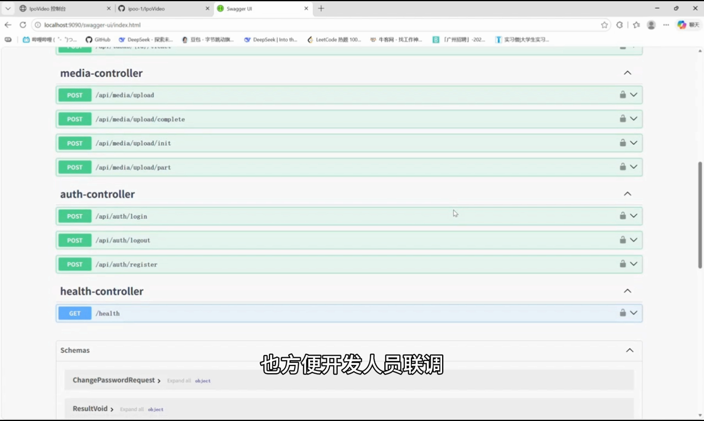
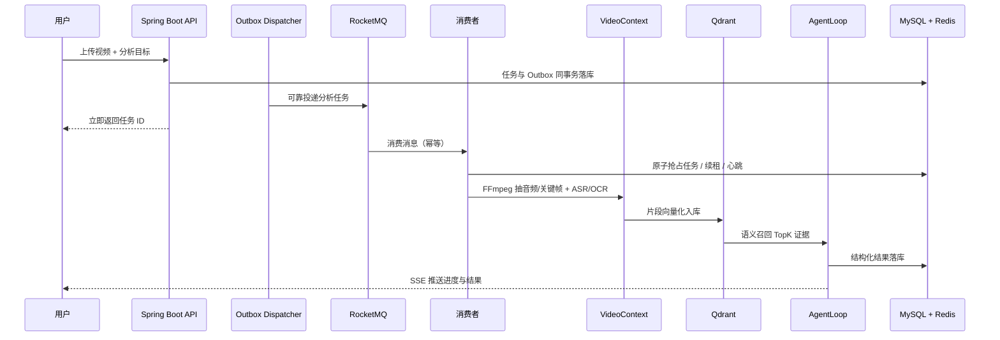

# IpoVideo

面向长视频内容理解的 AI Agent 平台：上传课程、会议或操作录屏后，系统异步完成
语音与画面理解，由 Agent 生成**可检索、可追溯、可追问**的结构化结论。


## 项目演示

[](docs/demo/IpoVideo-demo.mp4)

> GitHub README 不支持直接播放仓库中的 MP4，因此使用 GIF 自动播放预览；点击预览图可打开完整演示视频。

## 界面预览

以下为演示录屏截帧，完整操作以视频为准。

| 录屏截帧 1 | 录屏截帧 2 | 录屏截帧 3 |
| :---: | :---: | :---: |
|  |  |  |
|  |  |  |

## 系统架构



## 核心能力

- **异步任务**：RocketMQ 削峰解耦，任务状态机 PENDING/RUNNING/SUCCESS/FAILED
  全量落库，消费者提供终态重复消费保护，任务提交使用 Redis 锁防重。
- **可靠投递**：Transactional Outbox 保证任务记录和待投递事件同事务落库，
  Dispatcher 负责重试和幂等发布，避免 MQ 短暂不可用造成任务丢失。
- **Worker 租约**：Worker 原子抢占任务并定期续约，任务超时后可恢复重投，
  避免多实例重复执行和进程异常退出导致的任务永久卡住。
- **多模态上下文**：FFmpeg 抽取音频与关键帧，ASR 转写语音、Tesseract OCR
  识别画面文字，按时间窗口合并为 VideoContext；OCR 绑定采样帧时间，
  ASR 标记窗口内估算，避免把粗粒度时间伪装成精确时间。
- **受控 Agent**：Planner-Executor-Critic 工作流，DeepSeek 输出结构化 JSON，
  结论必须引用真实证据编号，Critic 和 Citation Validator 共同校验，最多两轮。
- **向量检索**：BGE-M3 Embedding + Qdrant 语义召回 TopK 证据，
  Qdrant/Embedding 不可用时自动降级为关键词匹配。
- **对象存储**：MinIO 存储视频，分片上传 + 断点续传，数据库仅存元数据。
- **接口与可观测性**：Swagger UI 提供 OpenAPI 文档和联调入口，任务进度通过
  一次性 SSE Ticket 推送，避免长期凭证暴露在查询参数中。
- **基础工程**：Flyway 迁移、统一响应、全局异常、Redis 会话与登录限流、
  Docker/CI 配置和 31 个自动化测试方法。

## 技术栈

| 层次 | 技术 |
| :--- | :--- |
| 语言/框架 | Java 21、Spring Boot 3、MyBatis-Plus |
| 数据 | MySQL 8、Flyway、Redis |
| 消息 | RocketMQ 5.3 |
| 存储 | MinIO（S3 兼容） |
| 检索 | Qdrant、BGE-M3 Embedding |
| AI | LangChain4j、DeepSeek（SiliconFlow） |
| 媒体 | FFmpeg、Tesseract（chi_sim+eng） |
| 接口 | Springdoc OpenAPI、Swagger UI、极简静态前端 |
| 工程化 | Docker、docker-compose、GitHub Actions |

## 快速开始

### 环境要求

- JDK 21、Maven（或使用 `mvnw`）
- MySQL 8、Redis、RocketMQ、MinIO、Qdrant
- FFmpeg、Tesseract（含 `chi_sim` 语言包）

### 配置

复制 `.env.example` 的变量到本机环境，数据库和 MinIO 不再提供可用默认口令：

```text
DB_URL=jdbc:mysql://localhost:3306/dovideo?...
DB_USERNAME=...
DB_PASSWORD=...
MINIO_ACCESS_KEY=...
MINIO_SECRET_KEY=...
SILICONFLOW_API_KEY=sk-...
```

未配置模型 Key 时，生产配置会让任务明确失败。仅在本地演示时可以显式设置
`ANALYSIS_DEMO_MODE=true`。

### 启动

```powershell
cd backend
.\mvnw.cmd spring-boot:run
```

本地开发可以执行：

```powershell
.\scripts\run-local.ps1
```

该脚本默认使用 Docker Compose 启动中间件；Docker 不可用时，也可以按下文各阶段文档使用本机 MySQL、Redis、RocketMQ、MinIO 和 Qdrant。

启动后可访问：

```text
前端控制台：http://localhost:9090/
Swagger UI：http://localhost:9090/swagger-ui.html
健康检查：http://localhost:9090/health
```

健康检查返回：

```text
GET http://localhost:9090/health
-> {"code":0,"message":"success","data":"UP"}
```

演示视频见 [完整演示](docs/demo/IpoVideo-demo.mp4)，录制步骤见 [演示脚本](docs/DEMO-SCRIPT.md)。

完整启动说明见各阶段讲义（`docs/`）。

## 测试

```powershell
cd backend
.\mvnw.cmd test
```

当前 31 个自动化测试方法覆盖认证、限流、任务链路、Outbox、Worker Lease、
恢复调度、分片上传、VideoContext、向量检索降级和证据引用校验等核心路径。
测试结果以最新 CI 和本地执行结果为准。

## 目录结构

```text
backend/        后端工程（Spring Boot）
docs/           产品分析、路线图、11 个阶段讲义
scripts/        演示与验证脚本
rocketmq/       RocketMQ 本地配置
.github/        CI 配置
```

## 验证与边界

- DeepSeek 生成、ASR、Embedding、Qdrant 检索均为真实调用并已实测。
- 时间戳为片段级定位，句子级定位是后续迭代方向。
- GitHub Actions 默认运行 AgentLoop、Outbox、Worker Lease 和 VideoContext 的 7 个无中间件单元测试；完整集成链路通过本机原生服务验证。
- 已提供极简前端控制台和 Swagger UI，定位为演示与联调，不是完整商业产品。
- Docker 本地受镜像网络影响时，可使用本机原生中间件启动项目。

## 文档

- [产品分析](docs/PRODUCT.md)
- [学习路线图](docs/ROADMAP.md)
- [简历素材](docs/RESUME.md)

## License

MIT
