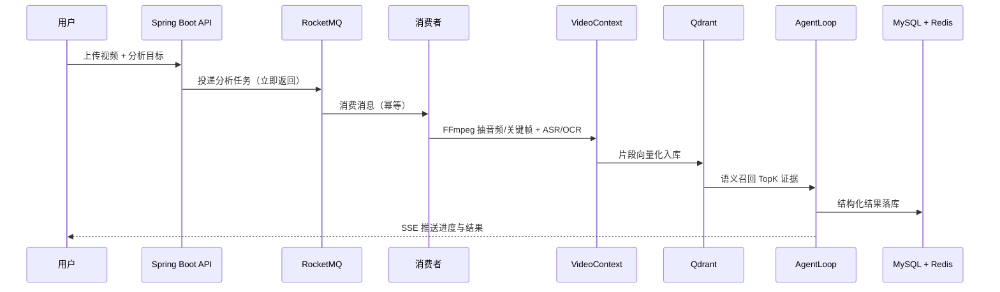

# IpoVideo

面向长视频内容理解的 AI Agent 平台：上传课程、会议或操作录屏后，系统异步完成
语音与画面理解，由 Agent 生成**可检索、可追溯、可追问**的结构化结论。


## 系统架构



## 核心能力

- **异步任务**：RocketMQ 削峰解耦，任务状态机 PENDING/RUNNING/SUCCESS/FAILED
  全量落库，消费者提供终态重复消费保护，任务提交使用 Redis 锁防重。
- **多模态上下文**：FFmpeg 抽取音频与关键帧，ASR 转写语音、Tesseract OCR
  识别画面文字，合并为带时间轴的 VideoContext。
- **受控 Agent**：Planner-Executor-Critic 工作流，DeepSeek 输出结构化 JSON，
  结论必须引用真实证据编号，Critic 和 Citation Validator 共同校验，最多两轮。
- **向量检索**：BGE-M3 Embedding + Qdrant 语义召回 TopK 证据，
  Qdrant/Embedding 不可用时自动降级为关键词匹配。
- **对象存储**：MinIO 存储视频，分片上传 + 断点续传，数据库仅存元数据。
- **基础工程**：Flyway 迁移、统一响应、全局异常、Redis 会话与登录限流、
  一次性 SSE 订阅凭证、Docker/CI 配置和 23 个自动化测试方法。

## 技术栈

| 层次 | 技术 |
| :--- | :--- |
| 语言/框架 | Java 21、Spring Boot 3、MyBatis-Plus |
| 数据 | MySQL 8、Flyway、Redis |
| 消息 | RocketMQ 5.3 |
| 存储 | MinIO（S3 兼容） |
| 检索 | Qdrant、BGE-M3 Embedding |
| AI | LangChain4j、DeepSeek（SiliconFlow） |
| 媒体 | FFmpeg、Tesseract（chi_sim+eng） |
| 工程化 | Docker、docker-compose、GitHub Actions |

## 快速开始

### 环境要求

- JDK 21、Maven（或使用 `mvnw`）
- MySQL 8、Redis、RocketMQ、MinIO、Qdrant
- FFmpeg、Tesseract（含 `chi_sim` 语言包）

### 配置

复制 `.env.example` 的变量到本机环境，数据库和 MinIO 不再提供可用默认口令：

```text
DB_URL=jdbc:mysql://localhost:3306/dovideo?...
DB_USERNAME=...
DB_PASSWORD=...
MINIO_ACCESS_KEY=...
MINIO_SECRET_KEY=...
SILICONFLOW_API_KEY=sk-...
```

未配置模型 Key 时，生产配置会让任务明确失败。仅在本地演示时可以显式设置
`ANALYSIS_DEMO_MODE=true`。

### 启动

```powershell
cd backend
.\mvnw.cmd spring-boot:run
```

验证：

```text
GET http://localhost:9090/health
-> {"code":0,"message":"success","data":"UP"}
```

完整启动说明见各阶段讲义（`docs/`）。

## 测试

```powershell
cd backend
.\mvnw.cmd test
```

当前 23 个自动化测试方法覆盖认证、限流、任务链路、分片上传、VideoContext、
向量检索降级和证据引用校验等核心路径。测试结果以最新 CI 和本地执行结果为准。

## 目录结构

```text
backend/        后端工程（Spring Boot）
docs/           产品分析、路线图、11 个阶段讲义
scripts/        演示与验证脚本
rocketmq/       RocketMQ 本地配置
.github/        CI 配置
```

## 验证与边界

- DeepSeek 生成、ASR、Embedding、Qdrant 检索均为真实调用并已实测。
- 时间戳为片段级定位，句子级定位是后续迭代方向。
- Docker/CI 配置已修复 MinIO 镜像和 RocketMQ 启动方式，需以最新 CI 结果为准。
- 本项目为后端工程，未包含前端界面。

## 文档

- [产品分析](docs/PRODUCT.md)
- [学习路线图](docs/ROADMAP.md)
- [简历素材](docs/RESUME.md)

## License

MIT
