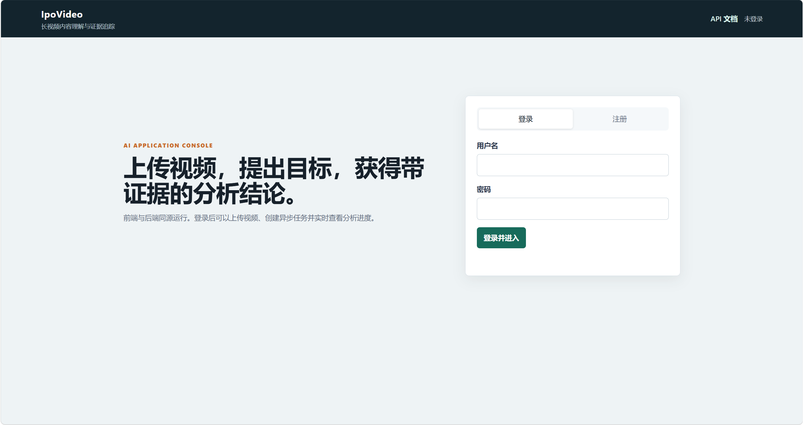
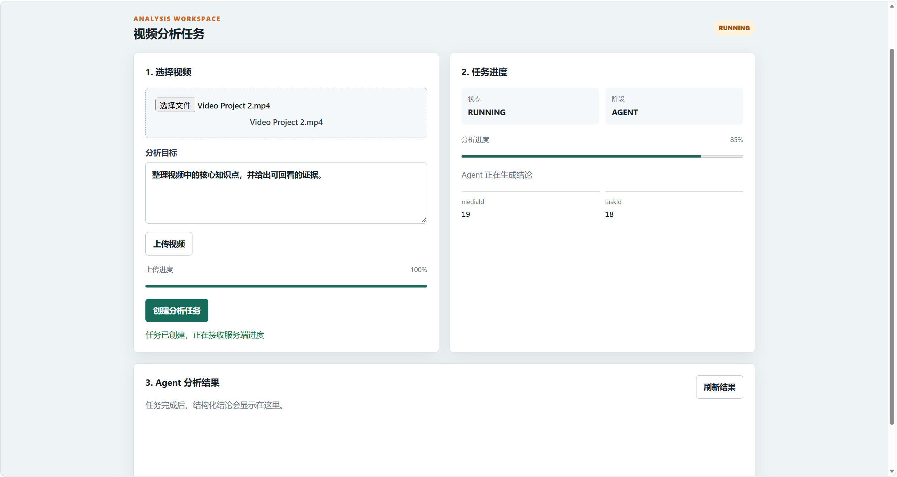
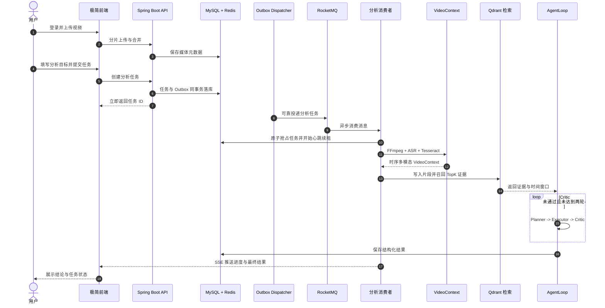
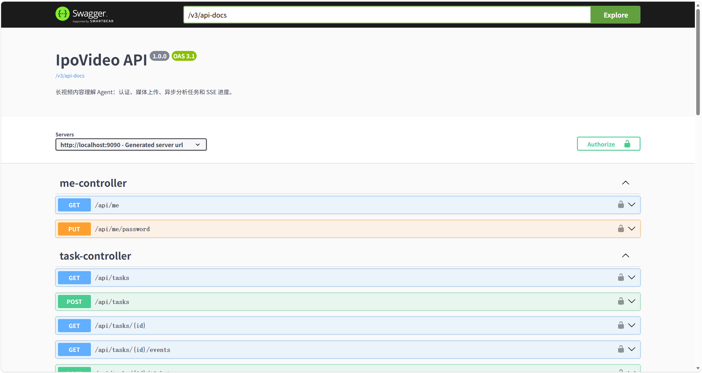

<div align="center">
  <h2>IpoVideo</h2>

  <a href="docs/demo/IpoVideo-demo.mp4">
    
  </a>

  <p>
    <sub>点击预览图打开完整演示视频</sub>
  </p>

  <p>
    <a href="https://github.com/ipoo-1/IpoVideo/actions/workflows/ci.yml"></a>
    
    
    
    
    
    
    
    
  </p>
</div>

<div align="center">

面向长视频内容理解的 <strong>Video Agent</strong>。

将课程、会议、访谈或操作录屏转化为可检索、可追溯、可校验的结构化结论。

</div>

## 项目预览

IpoVideo 提供极简前端控制台和 Swagger UI 两个入口。用户登录后可上传视频、创建分析任务、查看实时阶段进度、读取结构化 Agent 结果，并通过接口文档完成联调。

**登录界面**



前端控制台覆盖登录、注册、视频上传、任务提交、进度轮询和结果查看。页面保持轻量，核心价值集中在后端可靠的异步任务链路和受证据约束的 Agent 分析流程。

## 核心功能

长视频分析具有**耗时长、外部模型成本高、资源占用大、失败后恢复难**等特点。IpoVideo 的设计围绕这些问题展开，可以概括为四层能力。

### 🎬 可靠的视频任务链路

> 把耗时分析从请求主链路剥离；任务先可靠落库，再异步执行，避免消息丢失和重复执行。

- **分片上传**：后端提供 `init`、`part`、`complete` 三段式上传接口。分片先写入 MinIO，已上传分片记录在 Redis，补传缺片后可继续合并；完成后数据库只保存视频元数据和对象路径。
- **异步削峰**：创建任务时立即返回任务 ID，真正的视频下载、ASR、OCR、向量化和 Agent 分析由 RocketMQ 消费者异步完成。
- **Transactional Outbox**：任务记录和待投递事件在同一数据库事务中落库，`TaskOutboxDispatcher` 负责后续发布与指数退避重试，避免 MQ 短暂不可用导致任务永久丢失。
- **Worker Lease**：消费者通过数据库原子抢占任务，执行期间每 10 秒续租。租约过期后，`TaskRecoveryScheduler` 会把卡在 `RUNNING` 的任务重新入队。
- **幂等消费**：重复消息到达时，已进入 `SUCCESS` 或 `FAILED` 的任务会直接跳过；同一视频的并发提交由 Redis 锁和数据库二次查询共同拦截。

**任务处理界面**



### 🧩 时序多模态 VideoContext

> 把语音、画面文字和时间窗口融合成一份统一、可检索、可引用的视频上下文。

- **音频分支**：FFmpeg 从视频中抽取音频，再调用 SiliconFlow 的 `TeleAI/TeleSpeechASR` 完成语音转写。
- **视觉分支**：FFmpeg 按时间窗口采样关键帧，Tesseract 使用 `chi_sim+eng` 完成中英文 OCR。
- **时间窗口合并**：默认每 30 秒形成一个 `VideoSegment`，把该窗口内的 ASR 文本、OCR 文本、起止时间和采样帧名称统一保存。
- **时间语义区分**：OCR 结果绑定采样帧时间，ASR 文本标记为窗口内估算，避免把粗粒度时间伪装成句子级精确定位。
- **分支容错**：语音或视觉单路失败时会保留另一条有效信息；只有 ASR 和 OCR 都没有有效内容时，任务才会明确失败。

### 🔁 有证据约束的 AgentLoop

> 每条结论都必须引用输入证据，模型不能脱离视频内容自由发挥。

- **角色分工**：Planner 负责把用户目标拆成 1 到 5 个可执行任务；Executor 生成结构化结论和建议；Critic 检查目标覆盖度和结果质量。
- **结构化输出**：模型统一返回严格 JSON，`DeepSeekClient` 负责剥离 Markdown 代码块并解析；首次解析失败时会提示模型重新生成一次。
- **证据引用校验**：输入证据使用 `[E1]`、`[E2]` 编号，每条结论至少引用一个真实存在的编号。引用不存在或缺少证据的结论不会通过。
- **闭环修正**：Critic 不通过或引用校验失败时，上一轮问题会反馈给 Executor，最多执行两轮，兼顾修正质量和 Token 成本。
- **拒绝伪成功**：两轮仍未通过时任务会明确失败，不会把未经校验的内容包装成成功结果。

### 🔍 长视频检索与任务恢复

> 面向长视频的证据召回，以及可观测、可恢复的任务状态机。

- **语义检索**：`BGE-M3` 生成 1024 维向量，Qdrant 使用 Cosine 距离召回与用户目标最相关的 TopK 视频片段。
- **优雅降级**：Embedding 或 Qdrant 不可用时自动切换为本地关键词匹配，不阻断主分析链路。
- **任务恢复**：任务使用 `PENDING`、`RUNNING`、`SUCCESS`、`FAILED` 状态机；租约过期的任务通过 Outbox 重新投递。
- **实时进度**：任务阶段通过 SSE 推送。客户端先换取一次性 Ticket，再建立事件连接，避免把长期凭证直接暴露在查询参数中。
- **接口可观测**：统一返回结构、全局异常处理、Flyway 数据库迁移和 Swagger UI，方便本地联调与问题定位。

## 系统流程



## 技术栈

| 层次 | 技术 | 用途 |
| :--- | :--- | :--- |
| Web | HTML、CSS、JavaScript、SSE、Swagger UI | 登录、上传、任务进度、结果展示与接口联调 |
| API | Java 21、Spring Boot 3.5.9、MyBatis-Plus | 鉴权、媒体管理、任务编排与 REST API |
| 异步与缓存 | RocketMQ 5.3.4、Redis 7、Transactional Outbox | 异步削峰、会话、限流、防重锁与可靠投递 |
| 数据与存储 | MySQL 8、Flyway、MinIO | 业务数据、版本化建表、任务状态与视频对象 |
| 检索 | Qdrant、BGE-M3 Embedding | 视频片段向量化和目标语义召回 |
| 视频与 AI | FFmpeg、Tesseract、LangChain4j、DeepSeek、TeleSpeechASR | 音视频处理、OCR、Agent 推理与语音转写 |
| 工程化 | Docker Compose、GitHub Actions、JUnit 5 | 本地中间件编排、CI 和自动化测试 |

## 本地运行

### 环境要求

| 组件 | 要求 | 说明 |
| :--- | :--- | :--- |
| JDK | 21 | 后端编译和运行环境 |
| Docker | Compose v2 | 推荐用于启动 MySQL、Redis、MinIO、Qdrant 和 RocketMQ |
| FFmpeg | 可在指定路径执行 | 抽取音频与按时间窗口采样关键帧 |
| Tesseract | 安装 `chi_sim` 与 `eng` | 识别视频画面文字 |
| SiliconFlow API Key | 可选 | 未配置时可进入显式演示模式，但无法完成真实模型分析 |

先确认基础命令可用：

```powershell
java -version
docker compose version
ffmpeg -version
tesseract --version
```

如果 FFmpeg 或 Tesseract 不在项目默认路径，需要分别设置：

```powershell
$env:TOOL_FFMPEG_PATH = 'D:\path\to\ffmpeg.exe'
$env:TOOL_OCR_PATH = 'D:\path\to\tesseract.exe'
```

### 1. 准备配置

仓库提供 `.env.example` 作为配置清单。不要把真实密钥提交到 Git。

```powershell
Copy-Item .env.example .env
```

关键变量包括：

```text
DB_URL=jdbc:mysql://localhost:3306/dovideo?useSSL=false&serverTimezone=Asia/Shanghai&characterEncoding=utf8&allowPublicKeyRetrieval=true
DB_USERNAME=dovideo
DB_PASSWORD=change-me
REDIS_HOST=localhost
MINIO_ENDPOINT=http://localhost:9000
MINIO_ACCESS_KEY=change-me
MINIO_SECRET_KEY=change-me
QDRANT_URL=http://localhost:6333
ROCKETMQ_NAME_SERVER=127.0.0.1:9876
SILICONFLOW_API_KEY=sk-...
```

### 2. 启动中间件

如果 Docker 可用：

```powershell
docker compose up -d mysql redis minio qdrant rocketmq-namesrv rocketmq-broker
docker compose ps
```

Docker 不可用时，可以按相同端口手动启动本机 MySQL、Redis、MinIO、Qdrant、RocketMQ Namesrv 和 Broker。中间件端口如下：

| 服务 | 默认地址 |
| :--- | :--- |
| MySQL | `127.0.0.1:3306` |
| Redis | `127.0.0.1:6379` |
| MinIO | `http://127.0.0.1:9000` |
| Qdrant | `http://127.0.0.1:6333` |
| RocketMQ Namesrv | `127.0.0.1:9876` |
| RocketMQ Broker | `127.0.0.1:10911` |

### 3. 启动后端

方式一，使用本地脚本启动 Docker 中间件和后端：

```powershell
$env:SILICONFLOW_API_KEY = 'sk-...'
& .\scripts\run-local.ps1 -UseRealAI
```

如果 PowerShell 禁止执行脚本：

```powershell
Set-ExecutionPolicy -Scope Process Bypass
& .\scripts\run-local.ps1 -UseRealAI
```

方式二，中间件已手动启动时，直接启动后端：

```powershell
cd backend
.\mvnw.cmd spring-boot:run
```

后端默认地址为 `http://localhost:9090`，启动时会通过 Flyway 初始化或升级数据表。确认服务可用：

```powershell
Invoke-RestMethod http://localhost:9090/health
```

成功时返回：

```json
{"code":0,"message":"success","data":"UP"}
```

### 4. 打开控制台与 API 文档

```text
前端控制台：http://localhost:9090/
Swagger UI：http://localhost:9090/swagger-ui.html
OpenAPI JSON：http://localhost:9090/v3/api-docs
健康检查：http://localhost:9090/health
```

**Swagger UI**



### 常见问题

| 现象 | 处理方式 |
| :--- | :--- |
| `docker` 不是可识别命令 | 安装并启动 Docker Desktop，确认 `docker compose version` 可用；也可以改用本机原生中间件 |
| Docker 拉取镜像超时 | 检查代理、DNS 或镜像源；网络不可用时直接使用本机原生中间件 |
| 后端启动提示缺少 `DB_URL` | `.env` 不会自动注入到 Spring Boot，需要按 `.env.example` 设置对应环境变量，或使用 `scripts/run-local.ps1` |
| RocketMQ 报磁盘水位不足 | 调整 Broker 磁盘阈值或清理磁盘，确认 Broker 的 `store` 和 `index` 可写 |
| 任务一直停在 `PENDING` | 检查 RocketMQ Namesrv、Broker、消费者是否启动，以及 Outbox 是否成功发布 |
| 任务进入 `FAILED`，提示未配置模型 | 设置 `SILICONFLOW_API_KEY` 后重启后端；仅演示时才能设置 `ANALYSIS_DEMO_MODE=true` |
| OCR 或视频处理失败 | 确认 `TOOL_FFMPEG_PATH`、`TOOL_OCR_PATH` 正确，并安装 Tesseract 的 `chi_sim` 语言包 |

停止 Docker 中间件：

```powershell
docker compose down
```

## 测试

```powershell
cd backend
.\mvnw.cmd test
```

仓库当前包含 31 个 `@Test` 测试方法，覆盖认证、限流、任务链路、Outbox、Worker Lease、恢复调度、分片上传、VideoContext、向量检索降级和证据引用校验等路径。

GitHub Actions 默认执行 7 个不依赖中间件的单元测试：

```text
AgentLoopServiceTest
TaskOutboxDispatcherTest
TaskRecoverySchedulerTest
VideoContextServiceTest
```

完整集成测试需要本机或 Docker 中的 MySQL、Redis、MinIO、Qdrant 和 RocketMQ。

## 当前边界

- ASR 当前按时间窗口估算分布，OCR 绑定采样帧时间，定位精度为片段级，不是逐句或逐帧精确定位。
- SSE 连接当前保存在单实例内存中，多实例部署需要升级为 Redis Pub/Sub 或独立事件总线。
- 极简前端定位为演示和联调界面，不包含完整商业产品所需的权限后台、素材编辑和运营能力。
- GitHub Actions 默认只运行无中间件单元测试，完整链路依赖本机原生服务或 Docker Compose 验证。

## 目录结构

```text
IpoVideo
├── backend/                  # Spring Boot 后端
│   ├── src/main/java/        # 控制器、服务、消费者、DTO 与基础设施
│   ├── src/main/resources/   # 配置、SQL 迁移与极简静态前端
│   └── src/test/java/        # 单元测试与集成测试
├── docs/
│   ├── demo/                 # 演示视频、GIF 与界面截图
│   ├── PRODUCT.md            # 产品分析
│   ├── ROADMAP.md            # 优化路线图
│   └── STAGE-*.md            # 分阶段实现记录
├── rocketmq/                 # RocketMQ Broker 本地配置
├── scripts/                  # 本地启动与验证脚本
├── docker-compose.yml        # 本地中间件编排
├── docker-compose.ci.yml     # CI 中间件编排
└── .env.example              # 配置模板
```

## 文档

- [产品分析](docs/PRODUCT.md)
- [学习路线图](docs/ROADMAP.md)
- [简历素材](docs/RESUME.md)

## License

当前仓库尚未附带 `LICENSE` 文件。如需开源发布，请先补充明确的许可证。
